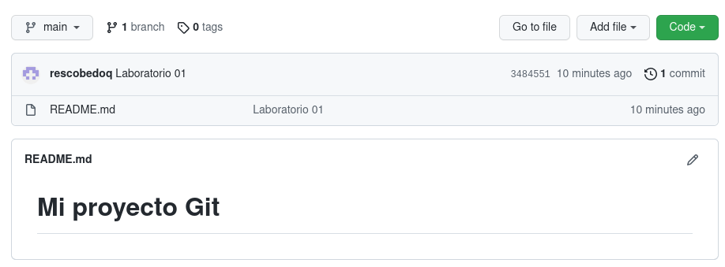

<div align="center">
<table>
    <theader>
        <tr>
            <td></td>
            <th>
                <span style="font-weight:bold;">UNIVERSIDAD NACIONAL DE SAN AGUSTIN</span><br />
                <span style="font-weight:bold;">FACULTAD DE INGENIERÍA DE PRODUCCIÓN Y SERVICIOS</span><br />
                <span style="font-weight:bold;">DEPARTAMENTO ACADÉMICO DE INGENIERÍA DE SISTEMAS E INFORMÁTICA</span><br />
                <span style="font-weight:bold;">ESCUELA PROFESIONAL DE INGENIERÍA DE SISTEMAS</span>
            </th>
            <td></td>
        </tr>
    </theader>
    <tbody>
        <tr><td colspan="3"><span style="font-weight:bold;">Formato</span>: Guía de Práctica de Laboratorio</td></tr>
        <tr><td><span style="font-weight:bold;">Aprobación</span>:  2022/03/01</td><td><span style="font-weight:bold;">Código</span>: GUIA-PRLD-001</td><td><span style="font-weight:bold;">Página</span>: 1</td></tr>
    </tbody>
</table>
</div>

<div align="center">
<span style="font-weight:bold;">GUÍA DE LABORATORIO</span><br />
</div>


<table>
<theader>
<tr><th colspan="6">INFORMACIÓN BÁSICA</th></tr>
</theader>
<tbody>
<tr><td>ASIGNATURA:</td><td colspan="5">Estructura de Datos y Algoritmos</td></tr>
<tr><td>TÍTULO DE LA PRÁCTICA:</td><td colspan="5">Revisión de elementos de programación (Parte I)</td></tr>
<tr>
<td>NÚMERO DE PRÁCTICA:</td><td>01</td><td>AÑO LECTIVO:</td><td>2022 A</td><td>NRO. SEMESTRE:</td><td>III</td>
</tr>
<tr>
<td>FECHA INICIO::</td><td>02-May-2022</td><td>FECHA FIN:</td><td>06-May-2022</td><td>DURACIÓN:</td><td>02 horas</td>
</tr>
<tr><td colspan="6">RECURSOS:
    <ul>
        <li><a href="https://git-scm.com/book/es/v2">https://git-scm.com/book/es/v2</a></li>
        <li><a href="https://guides.github.com/">https://guides.github.com/</a></li>        
        <li><a href="https://www.w3schools.com/java/default.asp">https://www.w3schools.com/java/default.asp</a></li>
    </ul>
</td>
</<tr>
<tr><td colspan="6">DOCENTES:
<ul>
<li>Richart Smith Escobedo Quispe - rescobedoq@unsa.edu.pe</li>
</ul>
</td>
</<tr>
</tdbody>
</table>

# Revisión de elementos de programación

[![License][license]][license-file]
[![Downloads][downloads]][releases]
[![Last Commit][last-commit]][releases]

[![Debian][Debian]][debian-site]
[![Git][Git]][git-site]
[![GitHub][GitHub]][github-site]
[![Vim][Vim]][vim-site]
[![Java][Java]][java-site]

#

## OBJETIVOS TEMAS Y COMPETENCIAS

### OBJETIVOS

- Conocer el editor de texto Vim.
- Aprender a manejar el sistema de control de versiones Git y utilizar GitHub para trabajar de manera colaborativa.
- Realizar ejercicios con el lenguaje de Programación Java.

### TEMAS
- Editor Vim
- Java
- Git
- GitHub

<details>
<summary>COMPETENCIAS</summary>

- C.m. Construye responsablemente soluciones haciendo uso de estructuras de datos y algoritmos, siguiendo un proceso adecuado para resolver problemas computacionales que se ajustan al uso de los recursos disponibles y a especificaciones concretas.

</details>

## CONTENIDO DE LA GUÍA

### MARCO CONCEPTUAL

- Editor Vim
    - Vim es un editor de texto muy eficiente para programar en consola que no tiene nada que envidiar a los editores gráficos.
    
- Instalar Vim en:

    - GNU/Linux
        - Para instalar Vim en cualquier distribución GNU/Linux use sus mismos repositorios
        - ```sh
          apt-get install vim
          ```

	- MS Windows
        - Para descarga en sistemas MS Windows https://www.vim.org/download.php
    
	- MacOS
        - Para instalar Vim en sistemas MacOS puede usar brew
        -   ```sh
            brew install macvim
            ```

#

- Java
    - Java es un lenguaje de programación orientado a objetos
    - La documentación de Java 11 se encuentra en: https://docs.oracle.com/javase/specs/jls/se11/html/index.html
    - Un curso muy interesante en videos se puede encontrar en: https://www.youtube.com/playlist?list=PLw8RQJQ8K1yQDqPyDRzt-h8YlBj96OwMP
    
    - Instalar Java

        - GNU/Linux
            - Para descarga en sistemas GNU/Linux puede usar OpenJDK
            -   ```sh
                apt-get install openjdk-11-jdk
                ```
            
        - MS Windows
            - Para descarga en sistemas MS Windows https://www.oracle.com/java/technologies/downloads/
        
        - MacOS
            - Para descarga en sistemas MacOS https://www.oracle.com/java/technologies/downloads/


#

- Git
    - Git es un sistema de control de versiones creado por Linus Torvalds. Es eficiente, confiable. 

- Instalar Git

	- GNU/Linux
        - Para descarga en sistemas GNU/Linux desde https://git-scm.com/download/linux
        -   ```sh
            apt-get install git
            ```
        
	- MS Windows
        - Para descarga en sistemas MS Windows https://git-scm.com/download/win
    
    - MacOS
        - Para descarga en sistemas MacOS https://git-scm.com/download/mac
        -   ```sh
            brew install git
            ```

#
       
- git init
    - Crea un nuevo proyecto local, se crean archivos en el directorio oculto .git
    -   ```sh
        git init
        ```

- git config
    - Establece variables de configuración. Por ejemplo para los commits se necesita los datos del desarrollador. Se puede especificar el editor y hasta el tiempo que deseas almacenar tus credenciales en la cache y otras cosas más
    -   ```sh
        git config --global user.name "Richart Smith Escobedo Quispe"
        git config --global user.email richarteq@gmail.com
        git config --list
        git config user.name
        git config --global core.editor "code --wait"
        git config --global credential.helper 'cache --timeout=3600'
        ```

- git status
    - Permite verificar el estado de los archivos
    -   ```sh
        git status
        ```
- git add
    - Añade archivos al staging area. El punto "." agrega todos
    -   ```sh
        git add HolaMundo.java
        git add .
        ```

- git commit
    - Sube los archivos al área de staging, en la máquina local. La opción -m permite escribir el mensaje en línea
    -   ```sh
        git commit -m "Probando el Hola Mundo"    
        ```

- git clone
    - Clona un repositorio remoto como un repositorio local, en el cual se puede hacer push
    -   ```sh
        git clone <URL_GITHUB>
        ```

- git remote
    - Persigue un repositorio remoto para hacer push.
    -   ```sh
        git remote add origin <URL_GITHUB>
        ```

- git push
    - Permite subir archivos al repositorio remoto
    -   ```sh
        git push -u origin main    
        ```

- git show
    - Muestra detalles del commit actual
    -   ```sh
        git show
        ```

-   git log
    - Permite ver un resumen de los commit realizados
    -   ```sh
        git log
        git log --pretty=oneline
        git log --graph --pretty=oneline --abbrev-commit --all
        git log --pretty=format:"%h - %an, %ar : %s"
        git log -p -2
        ```
    -   <pre>
        6bb6b6e - Richart Escobedo Quispe, hace 3 minutos : Git - GitHub
        6bb6b6e - Richart Escobedo Quispe, hace 12 minutos : Git - GitHub
        b36a9fd - Richart Escobedo Quispe, hace 14 minutos : Git - GitHub
        e86aac8 - Richart Escobedo Quispe, hace 22 minutos : Git - GitHub
        e58f653 - Richart Escobedo Quispe, hace 31 minutos : first commit
        5747062 - Richart Escobedo Quispe, hace 35 minutos : first commit
        </pre>

- git diff
    - Permite comparar los cambios en los archivos
    -   ```sh
        git diff 6bb6b6e 6bb6b6e
        ```

- git branch
    - Permite ver las ramas existentes o crea una rama alternativa al proyecto principal git branch -a
    -   ```sh
        git branch prueba1
        git branch
        ```
    -   <pre>
        * main
        prueba1
        </pre>

- git checkout
    - Permite regresar a versiones anteriores o saltar a otra rama
    -   ```sh
        git checkout prueba1
        git branch
        ```
    -   <pre>
        main
        * prueba1
        </pre>


- git pull
    - Permite descargar los cambios del repositorio remoto al directorio local
    -   ```sh
        git pull
        ```
    -   ```sh
        git checkout nueva_rama
        git pull <remote repo>
        ```
    -   ```sh
        git checkout main
        git pull --rebase origin
        ```

#

## EJERCICIO RESUELTO POR EL DOCENTE
Primer repositorio en GitHub
- Creamos un nuevo proyecto en GitHub
    - 

- Crearemos un repositorio local usando git init
    -   ```sh
        pwd
        /home/richart/eda/lab01
        git init
        ```

- Crearemos un archivo Readme.md con contenido Markup
    -   ```sh
        echo "# Aqui irá mi informe de laboratorio" > README.md
        ```

- Agregaremos este archivo al staging area usando git add .
    -   ```sh
        git status
        ```
    -   <pre>
        En la rama main

        No hay commits todavía

        Archivos sin seguimiento:
        (usa "git add <archivo>..." para incluirlo a lo que se será confirmado)
        README.md
        no hay nada agregado al commit pero hay archivos sin seguimiento presentes (usa "git add" para hacerles seguimiento)
        </pre>
    -   ```sh
        git add README.md
        ```

- Hacemos un primer commit en nuestro repositorio local 
    -   ```sh
        git commit -m "Mi primer proyecto en github"
        ```
- Asociamos el repositorio local con el repositorio remoto 
    -   ```sh
        git remote add origin <URL_GITHUB>
        ```

- Actualizamos el repositorio remoto
    -   ```sh
        git push -u origin main
        ```

- Ahora podemos verificar en GitHub que nuestro repositorio se actualizó con el proyecto local
    - 

- Cree una clase Java HolaMundo.java que imprima un saludo, compílelo, ignore archivos binarios, agregue archivo al stating area, haga commit y súbalo al repositorio GitHub.
    -   ```sh
        vim HolaMundo.java
        ```
    -   <pre>
        public class HolaMundo
        {
            public static void main(String args[]) {
            
                /** */
                System.out.println ("¡Hola mundo!");

            }
        }
        </pre>
    -   ```sh    
        java -version
        ```
    -   <pre>
        openjdk version "11.0.14" 2022-01-18
        </pre>
    -   ```sh
        javac HolaMundo.java
        java HolaMundo
        ```
    -   <pre>
        ¡Hola mundo!
        </pre>
    -   ```sh
        vim .gitignore
        ```
    -   <pre>
        *.class
        .gitignore
        </pre>
    -   ```sh
        git add HolaMundo.java
        git commit -m "Hola Mundo"
        git remote <URL_GITHUB>
        git push -u origin main
        ```
    - Realizaremos un estudio de Java desde: https://www.w3schools.com/java/default.asp
#

## EJERCICIOS PROPUESTOS
- Cree una cuenta de usuario en GitHub usando su correo institucional.
- [opcional por ahora] Configure su cuenta de estudiante (https://education.github.com/pack).
- Cree un nuevo proyecto personal y desarrolle el ejercicio resuelto en clase. Haga 3 commits como mínimo y muéstrelos. Commit para "¡Hola mundo!", otro para "Bienvenida al curso" y otro para imprimir su nombre.
- Cree un proyecto grupal para trabajo colaborativo (de 3 a 5 integrantes).
- Cree un archivo por cada tema del manual de java (https://www.w3schools.com/java/default.asp), haga commit e inluyalo en su informe grupal (Dividanse los temas).
    - Java Tutorial
    - Java Methods
- Cree ramas para cada integrante y cada cierto tiempo una las ramas al main. No elimine nada para evidenciar ramas, main y commits.

#

## CUESTIONARIO
- ¿Por qué Git y GitHub son herramientas importantes para el curso?
- ¿Qué conductas éticas deberían promocionarse cuando se usa un Sistema de Control de Versiones?
- ¿Qué son los entándares de codificación?

#

## REFERENCIAS
- https://git-scm.com/book/es/v2
- https://guides.github.com/
- https://www.w3schools.com/java/default.asp

- Nano vs. Emacs vs. Vim (Editor Wars!) - https://www.linuxtrainingacademy.com/nano-emacs-vim/
- Emacs vs Vim - https://www.linuxteaching.com/article/emacs_vs_vim
- Vim or Emacs? The Debate is over… - https://cmd.com/blog/vim-or-emacs-the-debate-is-over/
- Por qué un editor de texto de hace 40 años machaca al "todopoderoso" Atom - https://www.xataka.com/aplicaciones/por-que-un-editor-de-texto-de-hace-40-anos-le-da-sopas-con-ondas-al-todopoderoso-atom

- Tutorial de Vim - http://www.truth.sk/vim/vimbook-OPL.pdf
- Teclado en Vim - http://www.viemu.com/vi-vim-cheat-sheet.gif
- Cómo Configurar VIM como VS Code - https://www.youtube.com/watch?v=XgQFzi3VkC8

- Empezando el Curso de Java - https://www.youtube.com/playlist?list=PLw8RQJQ8K1yQDqPyDRzt-h8YlBj96OwMP
- The Java® Language Specification Java SE 11 Edition - https://docs.oracle.com/javase/specs/jls/se11/html/index.html
- The Java™ Tutorials - https://docs.oracle.com/javase/tutorial/
- Java Course - http://www.vias.org/javacourse/wrapnt4F38D8_object_oriented_programming.html

#

[license]: https://img.shields.io/github/license/rescobedoq/pw2?label=rescobedoq
[license-file]: https://github.com/rescobedoq/pw2/blob/main/LICENSE

[downloads]: https://img.shields.io/github/downloads/rescobedoq/pw2/total?label=Downloads
[releases]: https://github.com/rescobedoq/pw2/releases/

[last-commit]: https://img.shields.io/github/last-commit/rescobedoq/pw2?label=Last%20Commit

[Debian]: https://img.shields.io/badge/Debian-D70A53?style=for-the-badge&logo=debian&logoColor=white
[debian-site]: https://www.debian.org/index.es.html

[Git]: https://img.shields.io/badge/git-%23F05033.svg?style=for-the-badge&logo=git&logoColor=white
[git-site]: https://git-scm.com/

[GitHub]: https://img.shields.io/badge/github-%23121011.svg?style=for-the-badge&logo=github&logoColor=white
[github-site]: https://github.com/

[Vim]: https://img.shields.io/badge/VIM-%2311AB00.svg?style=for-the-badge&logo=vim&logoColor=white
[vim-site]: https://www.vim.org/

[Java]: https://img.shields.io/badge/java-%23ED8B00.svg?style=for-the-badge&logo=java&logoColor=white
[java-site]: https://docs.oracle.com/javase/tutorial/


[![Debian][Debian]][debian-site]
[![Git][Git]][git-site]
[![GitHub][GitHub]][github-site]
[![Vim][Vim]][vim-site]
[![Java][Java]][java-site]

[![License][license]][license-file]
[![Downloads][downloads]][releases]
[![Last Commit][last-commit]][releases]