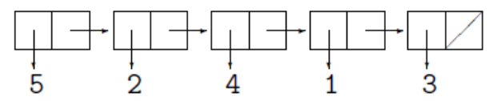
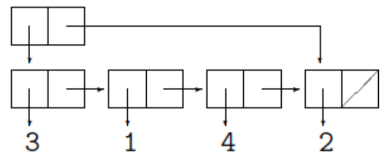
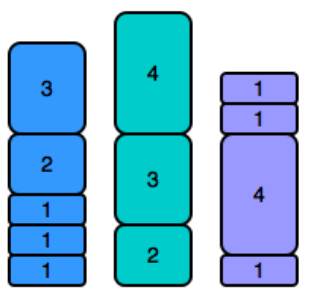
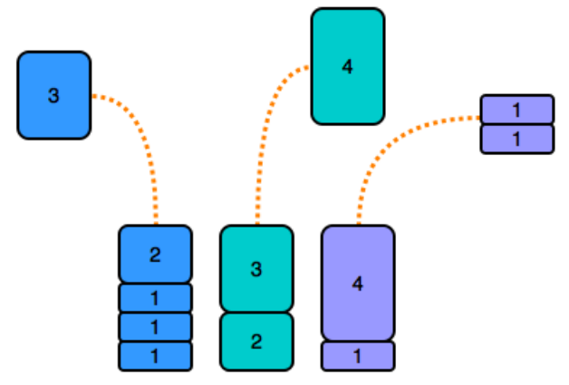

<table>
    <theader>
        <tr>
            <td></td>
            <th>
                UNIVERSIDAD NACIONAL DE SAN AGUSTIN 
                FACULTAD DE INGENIERÍA DE PRODUCCIÓN Y SERVICIOS 
                DEPARTAMENTO ACADÉMICO DE INGENIERÍA DE SISTEMAS E INFORMÁTICA 
                ESCUELA PROFESIONAL DE INGENIERÍA DE SISTEMAS
            </th>
            <td></td>
        </tr>
    </theader>
    <tbody>
        <tr><td colspan="3">Formato: Guía de Práctica de Laboratorio</td></tr>
        <tr><td>Aprobación:  2022/03/01</td><td>Código: GUIA-PRLD-001</td><td>Página: 1</td></tr>
    </tbody>
</table>

GUÍA DE LABORATORIO 

<table>
<theader>
<tr><th colspan="6">INFORMACIÓN BÁSICA</th></tr>
</theader>
<tbody>
<tr><td>ASIGNATURA:</td><td colspan="5">Estructura de Datos y Algoritmos</td></tr>
<tr><td>TÍTULO DE LA PRÁCTICA:</td><td colspan="5">Pilas y Colas</td></tr>
<tr>
<td>NÚMERO DE PRÁCTICA:</td><td>03</td><td>AÑO LECTIVO:</td><td>2022 A</td><td>NRO. SEMESTRE:</td><td>III</td>
</tr>
<tr>
<td>FECHA INICIO::</td><td>16-May-2022</td><td>FECHA FIN:</td><td>20-May-2022</td><td>DURACIÓN:</td><td>02 horas</td>
</tr>
<tr><td colspan="6">RECURSOS:
    <ul>
        <li>https://www.w3schools.com/java/</li>
        <li>https://www.eclipse.org/downloads/packages/release/2022-03/r/eclipse-ide-enterprise-java-and-web-developers</li>
        <li>https://docs.oracle.com/javase/8/docs/api/java/util/Stack.html</li>
        <li>https://docs.oracle.com/javase/8/docs/api/java/util/Queue.html</li>
    </ul>
</td>
</<tr>
<tr><td colspan="6">DOCENTES:
<ul>
<li>Richart Smith Escobedo Quispe - rescobedoq@unsa.edu.pe</li>
</ul>
</td>
</<tr>
</tdbody>
</table>

# Pilas y Colas

[![License][license]][license-file]
[![Downloads][downloads]][releases]
[![Last Commit][last-commit]][releases]

[![Debian][Debian]][debian-site]
[![Git][Git]][git-site]
[![GitHub][GitHub]][github-site]
[![Vim][Vim]][vim-site]
[![Java][Java]][java-site]

#

## OBJETIVOS TEMAS Y COMPETENCIAS

### OBJETIVOS

- Realizar ejercicios en temas de Estructuras de datos, Pilas, Colas.

### TEMAS
- Pilas
- Colas

COMPETENCIAS

- C.m. Construye responsablemente soluciones haciendo uso de estructuras de datos y algoritmos, siguiendo un proceso adecuado para resolver problemas computacionales que se ajustan al uso de los recursos disponibles y a especificaciones concretas.

## CONTENIDO DE LA GUÍA

### MARCO CONCEPTUAL

-   Introducción
    -   Diseño de algoritmos. 
    -   Diseño de estructuras de datos adecuadas.
    -   Algunas estructuras y algoritmos son más eficientes que otros para la misma tarea. 
    -   Nos concentraremos en algunas tareas básicas: Almacenamiento, Clasificación y Búsqueda de datos.
    -   Técnicas se aplican de manera general.

-   Algoritmos
    -   Algoritmo ~ Secuencia finita de instrucciones.
    -   Cada instrucción tiene un significado claro.
    -   Cantidad finita de esfuerzo.
    -   Período de tiempo finito.
    -   Si se va ejecutar por una computadora: lenguaje formal riguroso (inflexibles).
    -   Pseudocódigo: C y Java.

-   Estructuras de datos, tipos de datos abstractos
    -   (Casi siempre) Formular un algoritmo eficiente depende de poder organizar los datos de manera adecuada. 
    -   Estructura de datos ~ Forma particular de organizar los datos para tipos particulares de operaciones.
    -   Detalles: implementación en lenguajes de programación particulares o almacenamiento en memoria. 
    -   Modelos matemáticos abstractos de clases particulares de estructuras de datos o tipos de datos que tienen características comunes. 
    -   Tipos de datos abstractos y sus operaciones que se pueden realizar en ellos.
    -   (Por lo general) A partir de tipos de datos más primitivos (Ejemplo: enteros o cadenas). Extraer esos datos de ellos.
    -   Controlar el flujo de procesamiento en los algoritmos. 
    -   Encapsulación: Los detalles de implementación están ocultos para el usuario y protegidos del acceso externo.

-   Pilas
    -   (Nivel abstracto) Equivalentes a las listas enlazadas. 
    -   Son la estructura de datos ideal para modelar una estrategia de búsqueda First-In-Last-Out (FILO) o Last-In-First-Out (LIFO).
    -   Representación grafica:
        -   Similiar a una lista enlazada.
        -   Hay que tener cuidado con el orden de los elementos. 
        -   Ejemplo, la pila creada al insertar los números [3; 1; 4; 2; 5] en ese orden se representaría como:
        

-   Tipo de datos abstractos "Pila"
    -   Los operadores primitivos para las pilas suelen recibir nombres diferentes. 
    -   Los dos constructores son:
        -   EmptyStack  //Constructor de pilas vacías.
        -   push(element, stack)    //Toma un elemento y lo empuja encima de una pila existente.,
    -   Los dos selectores son:
        -   top(stack)  //Devuelve el elemento superior de una pila
        -   pop(stack)  //Devuelve la pila sin el elemento superior.

-   Implementación de Pilas
    -   Enfoque funcional: Empujar no cambia la pila original. Crea una nueva pila a partir de la pila original y un nuevo elemento. 
    -   Muchas pilas nuevas en un programa: Administración de memoria. 
    -   Una sola pila que se cambia de forma destructiva. Después de aplicar push, la pila original ya no salga, sino que se transforma en una nueva pila con un elemento adicional. -  -   Aplicar top a una pila dada puede dar diferentes respuestas.

-   Colas
    -   Estructura de datos utilizada para modelar una estrategia de primero en entrar, primero en salir (FIFO).
    -   Agregamos al final de una cola y quitamos elementos de su frente.
    -   Representación grafica:
        -   Similar a una lista o pila, pero con dos nodos adicionales.
        -   El primer elemento apunta al principio de la lista de todos los elementos de la cola.
        -   El segundo elemento apunta al último elemento de la lista. 
        -   Ejemplo, si insertamos los elementos [3; 1; 4; 2] en una cola inicialmente vacía, obtenemos:
        
        -   Tomar el primer elemento de la cola o agregar un elemento al final de la cola se puede hacer de manera eficiente. Esfuerzo constante independientemente de la longitud de la cola.
    
-   Tipos de datos abstractos "Cola"
    -   Una cola contiene los siguientes métodos:
        -   push(element, queue)  //Toma un elemento y una cola y devuelve una cola en la que el elemento se agrega a la cola original al final.
        -   top()   //Da el elemento superior de una cola, es decir, 3 en el ejemplo.
        -   pop(queue)  //Da la cola sin el elemento superior.
        -   isEmpty()
       
## EJERCICIOS PROPUESTOS

1. Pilas iguales (6 puntos)
    -   Tiene tres pilas de cilindros donde cada cilindro tiene el mismo diámetro, pero pueden variar en altura. Puede cambiar la altura de una pila quitando y descartando su cilindro superior tantas veces como desee.
    -   Encuentre la altura máxima posible de las pilas de modo que todas las pilas tengan exactamente la misma altura. 
    -   Esto significa que debe eliminar cero o más cilindros de la parte superior de cero o más de las tres pilas hasta que tengan la misma altura y luego devolver la altura.

    -   Ejemplo:
        -   Dado h1 = [1,2,1,1], h2 = [1,1,2] y h3 = [1,1]. 
        -   Hay cilindros en las tres pilas, con sus alturas en las tres matrices.
        -   Retire los 2 cilindros superiores de h1 (alturas = [1, 2]) y de h2 (alturas = [1, 1])para que las tres pilas tengan 2 unidades de altura. 
        -   Devuelve 2 como respuesta. 
        -   Nota: una pila vacía sigue siendo una pila.
    
    -   Complete la función equalStacks. equalStacks tiene los siguientes parámetros:
        -   int h1[n1]: el primer arreglo de alturas
        -   int h2[n2]: el segundo arreglo de alturas
        -   int h3[n3]: el tercer arreglo de alturas
    
    -   Retorno
        -   int: la altura de las pilas cuando se igualan
    
    -   Explicación ilustrativa
        -   Dadas 3 pilas: h1 = [1,1,1,2,3], h2 = [2,3,4] y h3 = [1,4,1,1]. Se ven así:
        -   

        -   Para igualar sus alturas, retire el primer cilindro de las pilas y dos cilindros de la pila, y luego quitar la parte superior(como se muestra a continuación).

        -   
        -   Las alturas de pila se reducen de la siguiente manera:
            -   8 − 3 = 5
            -   9 − 4 = 5
            -   7 − 1 − 1 = 5
            -   Las tres pilas ahora tienen altura = 5, el valor a devolver.

2.  Pilas (6 puntos)
    -   Implementa una pila usando POO con tipos genéricos siguiendo los estándares de Java (los métodos para una pila) verifique: 
    -   https://docs.oracle.com/javase/7/docs/api/java/util/Stack.htm

3.  Colas (6 puntos)
    -   Implementa una cola usando POO con tipos genéricos siguiendo los estándares de Java (los métodos para una cola) verifique:
    -   https://docs.oracle.com/javase/8/docs/api/java/util/Queue.html

#
¿Cómo empezar? 

*  Implemente una clase Node<T> donde T es un tipo genérico, esta clase debe contener al menos dos propiedades. 
*   Para obtener más información sobre la verificación genérica: https://docs.oracle.com/javase/tutorial/java/generics/types.html

    1. Datos T: la información almacenada en el nodo.
    2. Node<T> nextNode: una referencia al siguiente nodo.

*   Implementar las clases Stack<T> y Queue<T> deberían contener al menos esta propiedad
    1. Node<T> root: la referencia sobre el nodo inicial

#

## CUESTIONARIO
- ¿Qué similitudes hay entre una Lista Enlazada y una Pila? ( 1 pt)
- ¿En que casos seria favorable/desfavorable utilizar Pila/Cola?  ( 1 pt)

#

## REFERENCIAS
    - https://www.w3schools.com/java/
    - https://www.eclipse.org/downloads/packages/release/2022-03/r/eclipse-ide-enterprise-java-and-web-developers
    - https://docs.oracle.com/javase/8/docs/api/java/util/Stack.html
    - https://docs.oracle.com/javase/8/docs/api/java/util/Queue.html
#

[license]: https://img.shields.io/github/license/rescobedoq/pw2?label=rescobedoq
[license-file]: https://github.com/rescobedoq/pw2/blob/main/LICENSE

[downloads]: https://img.shields.io/github/downloads/rescobedoq/pw2/total?label=Downloads
[releases]: https://github.com/rescobedoq/pw2/releases/

[last-commit]: https://img.shields.io/github/last-commit/rescobedoq/pw2?label=Last%20Commit

[Debian]: https://img.shields.io/badge/Debian-D70A53?style=for-the-badge&logo=debian&logoColor=white
[debian-site]: https://www.debian.org/index.es.html

[Git]: https://img.shields.io/badge/git-%23F05033.svg?style=for-the-badge&logo=git&logoColor=white
[git-site]: https://git-scm.com/

[GitHub]: https://img.shields.io/badge/github-%23121011.svg?style=for-the-badge&logo=github&logoColor=white
[github-site]: https://github.com/

[Vim]: https://img.shields.io/badge/VIM-%2311AB00.svg?style=for-the-badge&logo=vim&logoColor=white
[vim-site]: https://www.vim.org/

[Java]: https://img.shields.io/badge/java-%23ED8B00.svg?style=for-the-badge&logo=java&logoColor=white
[java-site]: https://docs.oracle.com/javase/tutorial/

[![Debian][Debian]][debian-site]
[![Git][Git]][git-site]
[![GitHub][GitHub]][github-site]
[![Vim][Vim]][vim-site]
[![Java][Java]][java-site]

[![License][license]][license-file]
[![Downloads][downloads]][releases]
[![Last Commit][last-commit]][releases]