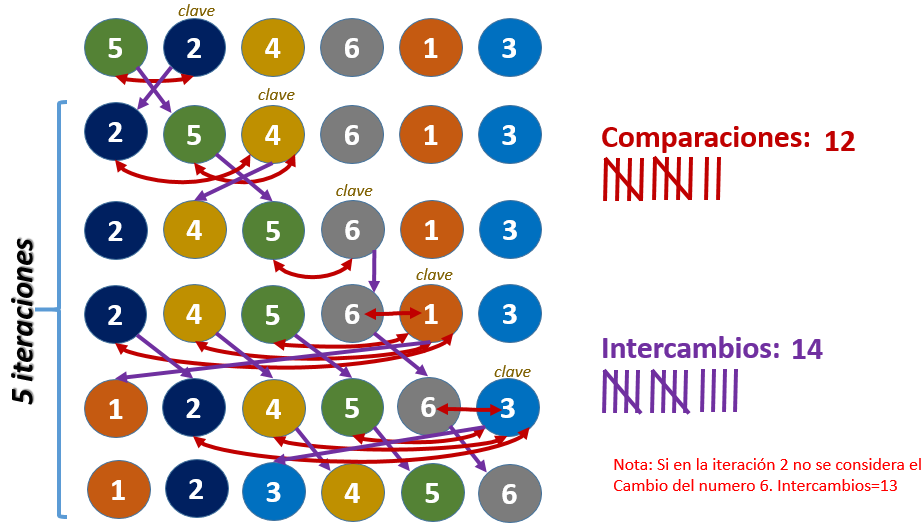

<div align="center">
<table>
    <theader>
        <tr>
            <td></td>
            <th>
                <span style="font-weight:bold;">UNIVERSIDAD NACIONAL DE SAN AGUSTIN</span><br />
                <span style="font-weight:bold;">FACULTAD DE INGENIERÍA DE PRODUCCIÓN Y SERVICIOS</span><br />
                <span style="font-weight:bold;">DEPARTAMENTO ACADÉMICO DE INGENIERÍA DE SISTEMAS E INFORMÁTICA</span><br />
                <span style="font-weight:bold;">ESCUELA PROFESIONAL DE INGENIERÍA DE SISTEMAS</span>
            </th>
            <td></td>
        </tr>
    </theader>
    <tbody>
        <tr><td colspan="3"><span style="font-weight:bold;">Formato</span>: Guía de Práctica de Laboratorio</td></tr>
        <tr><td><span style="font-weight:bold;">Aprobación</span>:  2022/03/01</td><td><span style="font-weight:bold;">Código</span>: GUIA-PRLD-001</td><td><span style="font-weight:bold;">Página</span>: 1</td></tr>
    </tbody>
</table>
</div>

<div align="center">
<span style="font-weight:bold;">GUÍA DE LABORATORIO</span><br />
</div>


<table>
<theader>
<tr><th colspan="6">INFORMACIÓN BÁSICA</th></tr>
</theader>
<tbody>
<tr><td>ASIGNATURA:</td><td colspan="5">Estructura de Datos y Algoritmos</td></tr>
<tr><td>TÍTULO DE LA PRÁCTICA:</td><td colspan="5">Sort y Listas Enlazadas</td></tr>
<tr>
<td>NÚMERO DE PRÁCTICA:</td><td>04</td><td>AÑO LECTIVO:</td><td>2022 A</td><td>NRO. SEMESTRE:</td><td>III</td>
</tr>
<tr>
<td>FECHA INICIO::</td><td>06-Jun-2022</td><td>FECHA FIN:</td><td>10-Jun-2022</td><td>DURACIÓN:</td><td>02 horas</td>
</tr>
<tr><td colspan="6">RECURSOS:
    <ul>
        <li>https://www.w3schools.com/java/</li>
        <li>https://www.eclipse.org/downloads/packages/release/2022-03/r/eclipse-ide-enterprise-java-and-web-developers</li>
        <li>https://javaplot.panayotis.com/</li>
        <li>https://sourceforge.net/projects/gnuplot/files/gnuplot/5.4.3/</li>
    </ul>
</td>
</<tr>
<tr><td colspan="6">DOCENTES:
<ul>
<li>Richart Smith Escobedo Quispe - rescobedoq@unsa.edu.pe</li>
</ul>
</td>
</<tr>
</tdbody>
</table>

# Sort y Listas Enlazadas

[![License][license]][license-file]
[![Downloads][downloads]][releases]
[![Last Commit][last-commit]][releases]

[![Debian][Debian]][debian-site]
[![Git][Git]][git-site]
[![GitHub][GitHub]][github-site]
[![Vim][Vim]][vim-site]
[![Java][Java]][java-site]

#

## OBJETIVOS TEMAS Y COMPETENCIAS

### OBJETIVOS

- Estudiar el algoritmo de ordenamiento por inserción.
- Utilizar Listas Enlazadas para guardar los datos.

### TEMAS
-   Algoritmo de ordenamiento por inserción iterativo.
-   Peor caso del algoritmo por inserción iterativo.
-   

<details>
<summary>COMPETENCIAS</summary>

- C.m. Construye responsablemente soluciones haciendo uso de estructuras de datos y algoritmos, siguiendo un proceso adecuado para resolver problemas computacionales que se ajustan al uso de los recursos disponibles y a especificaciones concretas.

</details>

## CONTENIDO DE LA GUÍA

### MARCO CONCEPTUAL

-   Algoritmo de ordenamiento por inserción iterativo
    

    ```sh
    public static void insertionSort(int[] A) {
		int key;
		int i;
		for (int j=1; j<A.length; j=j+1) {
			key = A[j];
			//Insertar A[j] en la secuencia ordenada A[1..j-1]
			i=j-1;
			while(i>-1 && A[i]>key) {
				A[i+1] = A[i];
				i = i-1;
			}
            imprimirArreglo(A);
			A[i+1] = key;
		}		
	}
    ```
-   Imprimir una lista:
    ```sh
    public static void imprimirArreglo(int[] lista){
		System.out.println("");
		for (int x=0; x<lista.length; x++) {
			System.out.print(lista[x] + " ");
		}
	}
    ```

-   Probar el algoritmo de ordamiento por inserción:
    ```sh
    public static void main(String[] args) {
		int[] lista = {5, 2, 4, 6, 1, 3};
		imprimirArreglo(lista);
		insertionSort(lista);
	}
    ```
-   Analisis:
    
    

-   Generación de peores casos:
    ```sh
    public static int[] generarPeorCaso(int t) {
		int[] lista= new int[t];
		for (int i=0; i<t; i++) {
			lista[i] = t-i;		
		}
		return lista;		
	}
    ```
-   Probar algoritmo con peores casos:
    ```sh
    public static void main(String[] args) {		
		int tamano;
        
		Scanner teclado = new Scanner( System.in );
        System.out.print( "Introduzca el tamaño del arreglo: " );
        tamano = teclado.nextInt();
        
        int arreglo[] = generarPeorCaso(tamano);
		imprimirArreglo(arreglo);
		insertionSort(arreglo);
	}
    ```
-   Modificación del algoritmo de inserción para devolver tiempo de ejecición:
    ```sh
    public static long insertionSort(int[] A) {
		int key;
		int i;
		long nano_startTime = System.nanoTime(); 
		for(int j=1; j<A.length; j=j+1) {
			key = A[j];
			//Insertar A[j] en la secuencia ordenada A[1..j-1]
			i = j-1;
			while(i>-1 && A[i]>key) {
				A[i+1] = A[i];
				i = i-1;
			}
			A[i+1] = key;
			//imprimirArreglo(A);
		}
		long nano_endTime = System.nanoTime();		
		return nano_endTime - nano_startTime;		
	}
    ```
-   Generar peores casos:
    ```sh
    public static void main(String[] args) {		
		int tamano;		        
		Scanner teclado = new Scanner( System.in );
        System.out.print( "Introduzca el tamaño máximo del último arreglo: " );
        tamano = teclado.nextInt();
        
        ArrayList<int[]> casos = new ArrayList<int[]>();        
        for(int n=1; n<=tamano; n++) {
        	casos.add(generarPeorCaso(n));
        }        
        Iterator<int[]> puntero = casos.iterator();
        while(puntero.hasNext()){
        	System.out.println(insertionSort(puntero.next()));
        }
	}
    ```
-   Estudiar la complejidad del peor caso de inserción iterativo:
    ```sh
    public static void main(String[] args) throws IOException {		
		int tamano;        
		Scanner teclado = new Scanner( System.in );
        System.out.print( "Introduzca el tamaño máximo del último arreglo: " );
        tamano = teclado.nextInt();        
        
        ArrayList<int[]> casos = new ArrayList<int[]>();        
        String archivoInsercion = "insercion.txt";
        PrintWriter oS = new PrintWriter(archivoInsercion);        
        
        for(int n=1; n<=tamano; n++) {
        	casos.add(generarPeorCaso(n));
        }        
        Iterator<int[]> puntero = casos.iterator();
        while(puntero.hasNext()){        	
        	oS.println( String.valueOf( insertionSort(puntero.next()) ) );        	
        }        
        oS.close();        
        // plot "/Users/richarteq/eclipse-workspace/Algoritmica/insercion.txt" with lines        
        JavaPlot p = new JavaPlot();
		p.addPlot("\"/home/richart/eclipse-workspace/Algoritmica/insercion.txt\" with lines");
		p.plot();		
	}
    ```
-   Ejecución:
    ```sh
    Introduzca el tamaño máximo del último arreglo: 10000
    ```
    
    
## EJERCICIOS PROPUESTOS

1.  Utilizar el tipo generico de Lista Enlazada para generar los peores casos y ejecutar el algoritmo de ordenamiento..

    -   List - Method get()
        ```sh
        public Node<T> get(int indice) {
            Node<T> aux=raiz;
            for(int i=0;i<indice;i++)
                aux=aux.getNextNode();
            return aux;
        }
        ```
    -   List - Method remove()
        ```sh
        public void remove(int indice) {
            if(indice<tamano) {
                if(indice==0)
                    raiz=raiz.getNextNode();
                else {
                    Node<T> anterior=this.get(indice-1);
                    anterior.setNextNode(this.get(indice+1));
                }
                tamano--;
            }
        }
        ```
2.  Utilizar el tipo generico de Doble Lista Enlazada para generar los peores casos y ejecutar el algoritmo de ordenamiento.
    ```sh
    public class Node <E > {
        Node () {
            this . data = null ;
            this . nextNode = null ;
            this . previousNode = null ;
        }
    
        Node ( E data ) {
            this . data = data ;
            this . nextNode = null ;
            this . previousNode = null ;
        }
    
        Node ( E data , Node <E > nextNode ) {
            this . data = data ;
            this . nextNode = nextNode ;
            this . previousNode = null ;
        }
    
        Node ( E data , Node <E > nextNode , Node <E > previousNode ) {
            this . data = data ;
            this . nextNode = nextNode ;
            this . previousNode = previousNode ;
        }
    
        private E data ;
        private Node <E > nextNode ;
        private Node <E > previousNode ;
    
        /* Getters y Setter ... */
    }
    ```


## CUESTIONARIO
-   ¿Cómo se ejecutaría sus implementaciones desde terminal(consola)? 
    Por ejemplo en el IDE Eclipse se agrega un jar externo así:
    
    ¿Cómo lo haría desde la terminal?

## REFERENCIAS
    - https://www.w3schools.com/java/
    - https://www.eclipse.org/downloads/packages/release/2022-03/r/eclipse-ide-enterprise-java-and-web-developers
    -   https://javaplot.panayotis.com/
    -   https://sourceforge.net/projects/gnuplot/files/gnuplot/5.4.3/

#

[license]: https://img.shields.io/github/license/rescobedoq/pw2?label=rescobedoq
[license-file]: https://github.com/rescobedoq/pw2/blob/main/LICENSE

[downloads]: https://img.shields.io/github/downloads/rescobedoq/pw2/total?label=Downloads
[releases]: https://github.com/rescobedoq/pw2/releases/

[last-commit]: https://img.shields.io/github/last-commit/rescobedoq/pw2?label=Last%20Commit

[Debian]: https://img.shields.io/badge/Debian-D70A53?style=for-the-badge&logo=debian&logoColor=white
[debian-site]: https://www.debian.org/index.es.html

[Git]: https://img.shields.io/badge/git-%23F05033.svg?style=for-the-badge&logo=git&logoColor=white
[git-site]: https://git-scm.com/

[GitHub]: https://img.shields.io/badge/github-%23121011.svg?style=for-the-badge&logo=github&logoColor=white
[github-site]: https://github.com/

[Vim]: https://img.shields.io/badge/VIM-%2311AB00.svg?style=for-the-badge&logo=vim&logoColor=white
[vim-site]: https://www.vim.org/

[Java]: https://img.shields.io/badge/java-%23ED8B00.svg?style=for-the-badge&logo=java&logoColor=white
[java-site]: https://docs.oracle.com/javase/tutorial/


[![Debian][Debian]][debian-site]
[![Git][Git]][git-site]
[![GitHub][GitHub]][github-site]
[![Vim][Vim]][vim-site]
[![Java][Java]][java-site]

[![License][license]][license-file]
[![Downloads][downloads]][releases]
[![Last Commit][last-commit]][releases]