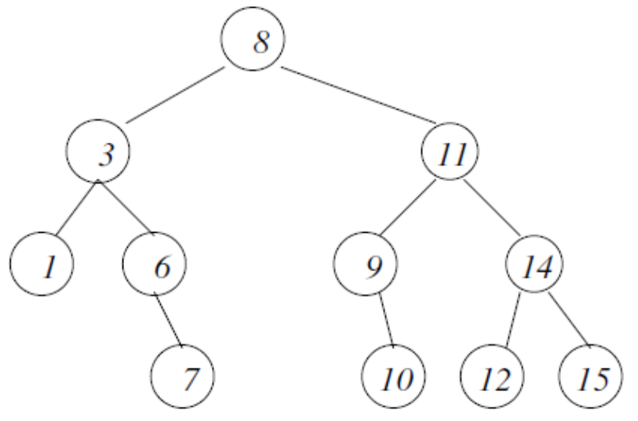

<div align="center">
<table>
    <theader>
        <tr>
            <td></td>
            <th>
                <span style="font-weight:bold;">UNIVERSIDAD NACIONAL DE SAN AGUSTIN</span><br />
                <span style="font-weight:bold;">FACULTAD DE INGENIERÍA DE PRODUCCIÓN Y SERVICIOS</span><br />
                <span style="font-weight:bold;">DEPARTAMENTO ACADÉMICO DE INGENIERÍA DE SISTEMAS E INFORMÁTICA</span><br />
                <span style="font-weight:bold;">ESCUELA PROFESIONAL DE INGENIERÍA DE SISTEMAS</span>
            </th>
            <td></td>
        </tr>
    </theader>
    <tbody>
        <tr><td colspan="3"><span style="font-weight:bold;">Formato</span>: Guía de Práctica de Laboratorio</td></tr>
        <tr><td><span style="font-weight:bold;">Aprobación</span>:  2022/03/01</td><td><span style="font-weight:bold;">Código</span>: GUIA-PRLD-001</td><td><span style="font-weight:bold;">Página</span>: 1</td></tr>
    </tbody>
</table>
</div>

<div align="center">
<span style="font-weight:bold;">GUÍA DE LABORATORIO</span><br />
</div>


<table>
<theader>
<tr><th colspan="6">INFORMACIÓN BÁSICA</th></tr>
</theader>
<tbody>
<tr><td>ASIGNATURA:</td><td colspan="5">Estructura de Datos y Algoritmos</td></tr>
<tr><td>TÍTULO DE LA PRÁCTICA:</td><td colspan="5">Árboles</td></tr>
<tr>
<td>NÚMERO DE PRÁCTICA:</td><td>05</td><td>AÑO LECTIVO:</td><td>2022 A</td><td>NRO. SEMESTRE:</td><td>III</td>
</tr>
<tr>
<td>FECHA INICIO::</td><td>20-Jun-2022</td><td>FECHA FIN:</td><td>24-Jun-2022</td><td>DURACIÓN:</td><td>02 horas</td>
</tr>
<tr><td colspan="6">RECURSOS:
    <ul>
        <li>https://www.w3schools.com/java/</li>
        <li>https://www.eclipse.org/downloads/packages/release/2022-03/r/eclipse-ide-enterprise-java-and-web-developers</li>
        <li>https://algorithmtutor.com/Data-Structures/Tree/AVL-Trees/</li>
        <li>https://docs.oracle.com/javase/tutorial/java/generics/types.html</li>
</td>
</<tr>
<tr><td colspan="6">DOCENTES:
<ul>
<li>Richart Smith Escobedo Quispe - rescobedoq@unsa.edu.pe</li>
</ul>
</td>
</<tr>
</tdbody>
</table>

# Árboles

[![License][license]][license-file]
[![Downloads][downloads]][releases]
[![Last Commit][last-commit]][releases]

[![Debian][Debian]][debian-site]
[![Git][Git]][git-site]
[![GitHub][GitHub]][github-site]
[![Vim][Vim]][vim-site]
[![Java][Java]][java-site]

#

## OBJETIVOS TEMAS Y COMPETENCIAS

### OBJETIVOS

- Estudiar arboles.

### TEMAS
-   Definiciones de árboles.
-   Operaciones con árboles.

<details>
<summary>COMPETENCIAS</summary>

- C.m. Construye responsablemente soluciones haciendo uso de estructuras de datos y algoritmos, siguiendo un proceso adecuado para resolver problemas computacionales que se ajustan al uso de los recursos disponibles y a especificaciones concretas.

</details>

## CONTENIDO DE LA GUÍA

### MARCO CONCEPTUAL

#

-   Árboles
    -   En informática, un árbol es una estructura de datos muy general y poderosa que se asemeja a un árbol real. 
    -   Consiste en un conjunto ordenado de nodos vinculados en un gráfico conectado, en el que cada nodo tiene como máximo un nodo principal y cero o más nodos secundarios con un orden específico.

#

-   Especificación general de los árboles
    -   En general, podemos especificar que un árbol consta de nodos (también llamados vértices o puntos) y aristas (también llamadas líneas o, para enfatizar la direccionalidad, arcos) con una estructura similar a un árbol. 
    -   Por lo general, es más fácil representar los árboles pictóricamente, por lo que lo haremos con frecuencia. 
    -   Un ejemplo simple se da en la siguiente figura:
    

-   Definiciones formales de un Árbol
    -   Árbol vacío o como un nodo con una lista de árboles sucesores. 
    -   Los nodos generalmente, aunque no siempre, están etiquetados con un elemento de datos (como un número o una clave de búsqueda). 
    -   Nos referiremos a la etiqueta de un nodo como su valor. 
    -   Generalmente se usan nodos etiquetados con números enteros, pero uno podría elegir otra cosa con la misma facilidad, por ejemplo cadenas de caracteres.
    -   Siempre tiene que haber un nodo único de "nivel superior" conocido como la raíz.
    -   En la Figura anterior, el nodo raiz está etiquetado con 8. 
    -   Es importante tener en cuenta que, en informática, los árboles normalmente se muestran al revés, con la raíz formando el nivel superior. 
    -   Luego, dado un nodo, cada nodo en el siguiente nivel "hacia abajo", que está conectado al nodo dado a través de una rama, es un hijo de ese nodo.
    -   En la Figura, los hijos del nodo 8 son los nodos 3 y 11. 
    -   Por el contrario, el nodo (hay como máximo uno) conectado al nodo dado (a través de un borde) en el nivel superior, es su padre. 
    -   Por ejemplo, el nodo 11 es el padre del nodo 9 (y también del nodo 14). 
    -   Los nodos que tienen el mismo padre se conocen como hermanos: los hermanos están, por definición, siempre en el mismo nivel. 
    -   Si un nodo es hijo de un hijo de . . . de otro nodo, entonces decimos que el primer nodo es descendiente del segundo nodo. 
    -   Por el contrario, el segundo nodo es un antepasado del primer nodo. 
    -   Los nodos que no tienen hijos se conocen como hojas (por ejemplo, los nodos etiquetados con 1, 7, 10, 12 y 15 en la Figura). 
    -   Una ruta es una secuencia de aristas conectadas de un nodo a otro. 
    -   Los árboles tienen la propiedad de que para cada nodo existe un único camino que lo conecta con la raíz. 
    -   La profundidad o nivel de un nodo está dada por la longitud de este camino. Por tanto, la raíz tiene nivel 0, sus hijos tienen nivel 1, y así sucesivamente.
    -   La longitud máxima de un camino en un árbol también se denomina altura del árbol.
    -   Un camino de longitud máxima siempre va desde la raíz hasta una hoja. 
    -   El tamaño de un árbol viene dado por el número de nodos que contiene.
    -   Supondremos normalmente que todo árbol es finito, aunque en general ese no tiene por qué ser el caso. 
    -   El árbol de la Figura tiene una altura de 3 y un tamaño de 11. 
    -   Un árbol que consta de un solo nodo tiene una altura de 0 y un tamaño de 1. 
    -   El árbol vacío obviamente tiene un tamaño de 0 y está definido (convenientemente, aunque algo artificialmente) para tener una altura: 1. 
    -   Como la mayoría de las estructuras de datos, necesitamos un conjunto de operadores primitivos (constructores, selectores y condiciones) para construir y manipular los árboles. 

#

-   Propósitos de los árboles: tipos de árboles particularmente útiles.

-   Árboles binario de búsqueda
    -   Son un tipo particular de árbol binario que proporciona una forma eficiente de almacenar datos que permite encontrar elementos específicos lo más rápido posible.
    -   Elaboraciones de estos árboles: Árboles AVL y árboles B.
    -   Operan de manera más eficiente a expensas de requerir algoritmos más sofisticados.

-   Claves de búsqueda
    -   Si los elementos a buscar están etiquetados con claves comparables, uno puede ordenarlos y almacenarlos de tal manera que ya estén ordenados. 
    -   Estar "ordenados" puede significar diferentes cosas para diferentes claves, y qué clave elegir es una decisión de diseño importante. 
    -   Las claves de búsqueda, por simplicidad, normalmente serán números enteros (como los números de identificación de los estudiantes), pero en la práctica ocurren otras opciones. 
    -   Por ejemplo, las claves comparables podrían ser palabras. En ese caso, la comparabilidad generalmente se refiere al orden alfabético. 
    -   Si w y t son palabras, escribimos w < t para indicar que w precede a t en el orden alfabético. Si w = cama y t = cielo, entonces se cumple la relación w < t, pero este no es el caso si w = cama y t = ábaco. 
    -   Un ejemplo clásico de una colección para buscar es un diccionario. 
    -   Cada entrada del diccionario es un par formado por una palabra y una definición. 
    -   La definición es una secuencia de palabras y signos de puntuación. 
    -   La clave de búsqueda, en este ejemplo, es la palabra (a la que se adjunta una definición en la entrada del diccionario). 
    -   Así, en abstracto, un diccionario es una secuencia de 40 entradas, donde una entrada es un par formado por una palabra y su definición. 
    -   Esto es lo que importa desde el punto de vista de los algoritmos de búsqueda que vamos a considerar. 
    -   En lo que sigue, nos concentraremos en las claves de búsqueda, pero siempre debemos tener en cuenta que generalmente hay una entrada de datos más sustancial asociada con ella. 
    -   Observe el uso de la palabra "abstracto" aquí. Lo que queremos decir es que abstraemos o eliminamos cualquier detalle que sea irrelevante desde el punto de vista de los algoritmos. 
    -   Por ejemplo, un diccionario generalmente viene en forma de libro, que es una secuencia de páginas, pero para nosotros, la distribución de las entradas del diccionario en páginas es una característica accidental del diccionario. 
    -   Todo lo que nos importa es que el diccionario es una secuencia de entradas.
    -   Así que "abstracción" significa "deshacerse de los detalles irrelevantes".
    -   Para nuestros propósitos, solo la clave de búsqueda es importante, por lo que ignoraremos el hecho de que las entradas de la colección normalmente serán objetos más complejos (como en el ejemplo de un diccionario o una guía telefónica).
    -   Tenga en cuenta que siempre debemos emplear la estructura de datos para contener los elementos que funcionan mejor para la aplicación típica. 
    -   No hay una respuesta fácil sobre cuál es la mejor opción: se deben inspeccionar las circunstancias particulares y se debe tomar una decisión basada en eso.
    -   La solución a nuestro problema de búsqueda es almacenar la colección de datos que se buscarán usando un árbol binario de tal manera que la búsqueda de un elemento en particular requiera un esfuerzo mínimo. 
    -   La idea subyacente es simple: en cada nodo del árbol, queremos que el valor de ese nodo nos diga que hemos encontrado el elemento requerido o nos diga en cuál de sus dos subárboles debemos buscarlo. 
    -   Por el momento, asumiremos que todos los elementos en la recopilación de datos son distintos, con diferentes claves de búsqueda, por lo que cada valor de nodo posible aparece como máximo una vez, pero veremos más adelante que es fácil relajar esta suposición. Por lo tanto definimos:

#
-   ```Definición:``` 
    -   Un árbol de búsqueda binario es un árbol binario que está vacío o cumple las siguientes condiciones:
        -   Todos los valores que aparecen en el subárbol izquierdo son más pequeños que los de la raíz.
        -   Todos los valores que aparecen en el subárbol derecho son mayores que los de la raíz.
        -   Los subárboles izquierdo y derecho son árboles de búsqueda binarios.
    -   Entonces, este es solo un tipo particular de árbol binario, con valores de nodo que son las claves de búsqueda. Esto significa que podemos heredar muchos de los operadores y algoritmos que definimos para árboles binarios generales.
#

-   Equilibrar o Balancear árboles de búsqueda binarios

    -   Si los elementos se agregan a un árbol de búsqueda binaria en orden aleatorio, el árbol tiende a estar bastante bien equilibrado con una altura no mucho mayor que log2 n. 
    -   Sin embargo, hay muchas situaciones en las que los elementos agregados no están en orden aleatorio, como cuando se agregan nuevas identificaciones de estudiantes. 
    -   En el caso extremo de que los nuevos elementos se agreguen en orden ascendente, el árbol será una rama larga de a la derecha, con altura n >> log2n.
    -   Si todos los elementos que se insertarán en un árbol de búsqueda binario ya están ordenados, es sencillo construir un árbol binario perfectamente equilibrado a partir de ellos. Uno simplemente tiene que construir recursivamente un árbol binario con el elemento del medio (es decir, la mediana) como raíz, el subárbol izquierdo formado por los elementos más pequeños y el subárbol derecho formado por los elementos más grandes. 
    -   Esta idea se puede usar para reequilibrar cualquier árbol de búsqueda binaria existente, porque el árbol existente se puede generar fácilmente en una matriz ordenada.

#
    
-   Árboles AVL autoequilibrados
    -   Los árboles de búsqueda binaria autoequilibrados evitan el problema de los árboles desequilibrados al reequilibrar automáticamente el árbol a lo largo del proceso de inserción para mantener la altura cerca de log2n en cada etapa.
    -   Obviamente, habrá un costo involucrado en dicho reequilibrio, y habrá una compensación entre el tiempo involucrado en el reequilibrio y el tiempo ahorrado por la reducción de la altura del árbol, pero generalmente vale la pena. 
    -   El tipo más antiguo de árbol de búsqueda binario autoequilibrado fue el árbol AVL (llamado así por sus inventores GM Adelson-Velskii y EM Landis). 
    -   Estos mantienen la diferencia de alturas de los dos subárboles de todos los nodos para que sea como máximo uno. 
    -   Esto requiere que el árbol sea reequilibrado periódicamente realizando una o más rotaciones de árbol, pero la complejidad de inserción, eliminación y búsqueda permanece en O(log2n). 
    -   La idea general es realizar un seguimiento del factor de equilibrio para cada nodo, que es la altura del subárbol izquierdo menos la altura del subárbol derecho. 
    -   Por definición, todos los nodos en un árbol AVL tendrán un factor de equilibrio en el rango de enteros [-; 1]. 
    -   Sin embargo, la inserción o eliminación de un nodo podría dejarlo en un rango más amplio [-2; 2] que requiere una rotación de árbol para devolverlo a su forma AVL.


-   ```Tipo de dato abstracto 'Árbol AVL'```
    -   En un nivel abstracto, un árbol AVL se puede construir con los siguientes métodos:
    *   ```insert```, Agregar los datos como una hoja en el AVL.
    *   ```remove```, Elimina los datos del árbol.
    *   ```get(e)```, Devuelve los datos del árbol que coinciden con el parámetro pasado.
    *   ```contains(e)```, Devuelve si el parámetro está contenido dentro del árbol o no.


## EJERCICIOS PROPUESTOS

-   5.1 Corchetes equilibrados

    -   Se considera corchete cualquiera de los siguientes caracteres: (, ), {, }, [, o ]. 
    -   Se considera que dos corchetes son un par coincidente si un corchete de apertura (es decir, (, [, o ) aparece a la izquierda de un corchete de cierre (es decir, ), ] o ) del mismo tipo exacto. Hay tres tipos de pares de corchetes coincidentes: [], {} y ().
    -   Un par de corchetes coincidentes no está equilibrado si el conjunto de corchetes que encierra no coinciden.
    -   Por ejemplo, {[(])} no está equilibrado porque los contenidos entre { y } no están equilibrados.
    -   El par de corchetes encierra un solo corchete de apertura no balanceado, (, y el par de paréntesis encierra un solo corchete de cierre no balanceado, ].
    -   Por esta lógica, decimos que una secuencia de paréntesis está balanceada si se cumplen las siguientes condiciones:
        -   No contiene paréntesis que no coincidan.
        -   El subconjunto de corchetes encerrado dentro de los límites de un par de corchetes emparejados también es un par de corchetes emparejados.
    -   Dadas n cadenas de corchetes, determine si cada secuencia de corchetes está balanceada. 
        -   Si una cadena está balanceada, devuelve SÍ. 
        -   De lo contrario, devuelva NO.
    -   Función descriptiva
        -   Completa la función isBalanced. 
        -   isBalanced tiene los siguientes parámetros:
            -   string s: una cadena de corchetes
            -   Devoluciones
            -   cadena: ya sea SÍ o NO
        -   Ejemplos
            -   s='{[()]}' devuelve SÍ.
            -   s='[(])' devuelve NO.
            -   s='[[(())]]' devuelve SÍ.

#

-   5.2 Operaciones de árbol AVL
    -   Simule las siguientes operaciones de un árbol AVL
    -   1. Inserción: 100 - 200 - 300 - 400 - 500 - 50 - 25 - 350 - 375 - 360 - 355 - 150 - 175 - 120 - 190.
    -   2. Después de crear un árbol AVL, realice la eliminación: 100 - 200 - 300 - 400 - 500 - 50 - 25 - 350 - 375 - 360 - 355 - 150 - 175 - 120 - 190.
    -   Para este ejercicio tienes que escribir el paso a paso del desarrollo de cada operación donde se muestra gráficamente el estado del árbol así como el factor de equilibrio para cada nodo y el tipo de operación que se está realizando, es decir, inserción, eliminación, rotación.
    -   Este ejercicio no requiere implementación, solo escribe el desarrollo de cada uno operación paso a paso e incluirlo en el informe.

-   5.3 Árbol AVL
    -   Implementa un AVL con tipos genéricos siguiendo las interfaces 
    -   ¿Cómo empezar?
    -   (i) Implemente una clase Node<T> donde T es un tipo genérico, esta clase debe contener al menos el  siguientes propiedades.
        -   Para obtener más información sobre la verificación genérica: https://docs.oracle.com/javase/tutorial/java/generics/types.html
        -   1. Datos T: la información almacenada en el nodo.
        -   2. Node<T> rightNode: una referencia al siguiente nodo.
        -   3. Node<T> leftNode: una referencia al nodo anterior.
        -   4. Int balanceFactor: el factor de equilibrio del nodo.
    -   (ii) Implemente las clases AVLTree<T> que deben contener al menos estas propiedades
        -   1. Node<T> root: la referencia sobre el nodo inicial.
    -   (iii) Lectura sugerida:
        -   https://algorithmtutor.com/Data-Structures/Tree/AVL-Trees/


## REFERENCIAS
    - https://www.w3schools.com/java/
    - https://www.eclipse.org/downloads/packages/release/2022-03/r/eclipse-ide-enterprise-java-and-web-developers
    -   https://algorithmtutor.com/Data-Structures/Tree/AVL-Trees/
    -   https://docs.oracle.com/javase/tutorial/java/generics/types.html

#

[license]: https://img.shields.io/github/license/rescobedoq/pw2?label=rescobedoq
[license-file]: https://github.com/rescobedoq/pw2/blob/main/LICENSE

[downloads]: https://img.shields.io/github/downloads/rescobedoq/pw2/total?label=Downloads
[releases]: https://github.com/rescobedoq/pw2/releases/

[last-commit]: https://img.shields.io/github/last-commit/rescobedoq/pw2?label=Last%20Commit

[Debian]: https://img.shields.io/badge/Debian-D70A53?style=for-the-badge&logo=debian&logoColor=white
[debian-site]: https://www.debian.org/index.es.html

[Git]: https://img.shields.io/badge/git-%23F05033.svg?style=for-the-badge&logo=git&logoColor=white
[git-site]: https://git-scm.com/

[GitHub]: https://img.shields.io/badge/github-%23121011.svg?style=for-the-badge&logo=github&logoColor=white
[github-site]: https://github.com/

[Vim]: https://img.shields.io/badge/VIM-%2311AB00.svg?style=for-the-badge&logo=vim&logoColor=white
[vim-site]: https://www.vim.org/

[Java]: https://img.shields.io/badge/java-%23ED8B00.svg?style=for-the-badge&logo=java&logoColor=white
[java-site]: https://docs.oracle.com/javase/tutorial/


[![Debian][Debian]][debian-site]
[![Git][Git]][git-site]
[![GitHub][GitHub]][github-site]
[![Vim][Vim]][vim-site]
[![Java][Java]][java-site]

[![License][license]][license-file]
[![Downloads][downloads]][releases]
[![Last Commit][last-commit]][releases]